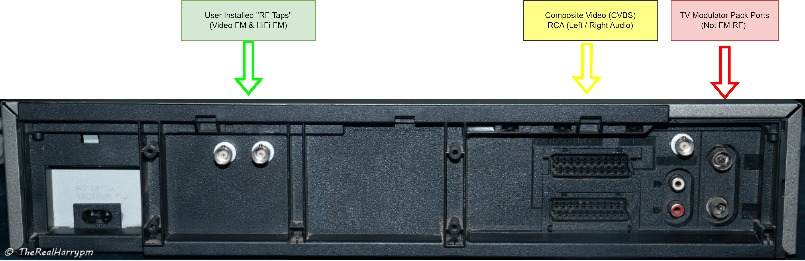

# VHS-Decode (It does more than VHS now!)

VHS-Decode is a cross platform tape focused decoding fork of [LD-Decode](https://github.com/happycube/ld-decode), the decoding software powering the [Domesday86 Project](https://www.domesday86.com/).  

This version has been modified to work with the differences found in the tracked RF drum head signals taken directly from various  colour-under & composite modulated magnetic tape formats.

> [!IMPORTANT]  
> Not to be confused with the TV Modulator/Demodulator pack or the **"antenna connectors"** on the back of a VCR!.

# The Decode Suite

# [Supported Tape Formats](https://github.com/oyvindln/vhs-decode/wiki/Tape-Support-List)

**VHS** 625-line and 525-line - NTSC, NTSC-J, PAL and PAL-M. **Generally well supported**

**SVHS** 625-line and 525-line - NTSC, NTSC-J, PAL and PAL-M. **Supported**

**U-Matic Low Band** 625-line and 525-line - PAL and NTSC. **Supported**

**U-Matic High Band** 625-line - PAL. **Basic support**

**Betamax** 625-line and 525-line - PAL & NTSC. **Suppported**

**Video8 & Hi8** 625-line and 525-line - PAL & NTSC. **Supported**

**1" Type C (SMPTE Type C)** 625-line and 525-line - PAL & NTSC. **Basic support** (More Samples Required!) 

**EIAJ** 625-line - PAL. **Supported** (NTSC Samples Required!) 

**Philips VCR** 625-line - PAL. **Supported**

# [FAQ - Frequently Asked Questions](https://github.com/oyvindln/vhs-decode/wiki/FAQ)

Basic Use Video:

- [VHS-Decode Official](https://odysee.com/@vhs-decode:7)
- [The Video Dump Channel](https://www.youtube.com/@videodumpchannel)
- [The Rewinding](https://odysee.com/@therewinding:4?view=content)
  
Example Workflow [Flowcharts and Graphics](https://github.com/oyvindln/vhs-decode/wiki/Diagram-Visuals)

The frequently asked questions page and the [Wiki](https://github.com/oyvindln/vhs-decode/wiki), will help break things down and explain the real world benefits of direct RF capture preservation and software decoding compared to conventional high-cost hardware based workflows, so if you have just found this project welcome to the affordable future of tape media preservation.

# [CVBS-Decode - Composite Video Decoder](https://github.com/oyvindln/vhs-decode/wiki/CVBS-Composite-Decode)

This repository also contains an **experimental** CVBS decoder, `cvbs-decode`, which shares code with ld-decode and vhs-decode. Capable of decoding basic raw digitized NTSC and PAL composite video, including colour if the source is somewhat stable. 

RAW CVBS has been captured using CX Cards & CXADC, however, only at lowest gain states, CVBS capture is not possible with the DomesDayDuplicator Rev3 due to input filtering on the hardware.

Test samples & signals can be generated using [HackTV](https://github.com/fsphil/hacktv)

Note for test media generation AJA/Magewell/Blackmagic and even some consumer digital to analogue converters have test generators built-in some prosumer/broadcast decks also have generators built in same for HDV camcorders.

# [HiFi-Decode](https://github.com/oyvindln/vhs-decode/wiki/003-Audio#hifi-decode-hifi-rf-into-audio-installation-and-usage) & [RTL-SDR Decode](https://github.com/oyvindln/vhs-decode/wiki/RTLSDR)

Thanks to VideoMem's work on [Superheterodyne Decoding Tools](https://github.com/VideoMem/Superheterodyne-decoding-tools) we now have HiFi-Decode! 

HiFi-Decode provides decoding for (S)VHS & Video8/Hi8 HiFi tracks which takes uncompressed or FLAC compressed RF captures of HiFi FM signals and can output standard 24-bit 48khz FLAC stereo files. 

RTLSDR decode can run in realtime (1~3 sec delay) and providing live playback, 8msps RF files and a 48khz 24-bit FLAC file of the decoded audio.

# Dependencies - Hardware

## A Working Tape Player (VCR/VTR etc)

Preferably adjusted per tape and in excellent mechanical and head condition, prosumer metal track decks are preferable as they were built generally better in terms of mechnical stability than cheaper later consumer decks that use more plastics, the only **crtical requirement** is avalible test points or a head amplifyer that is easy to tap into, this goes for any and all tape formats.

**Note** SVHS tapes can be RF captured on standard VHS HiFi decks.

**Note** SVHS NTSC Decks - Currently inflated, but you can import PAL decks with NTSC support for 1/3rd the price though this only applys if conventional refrance SVHS captures are required.

**Always clean your tape track/drum/heads** before and afterwards with 99.9% isopropanol and lint free cloths/pads/paper. This ensures less dropouts from dirty heads or tracks including the track of the head drum.

Its good practice to avoid cross contamination of tapes, especially if dealing with mouldy or contaminated tapes.  

It also helps to make sure to re-lubricate metal and plastic moving joints cogs and bearings with appropriate greases and oils to avoid mechanical failures. Please read the [Cleaning & Servicing Guide](https://github.com/oyvindln/vhs-decode/wiki/Cleaning-&-Servicing-Guide)

## An RF Capture Device

Currently standardised is 2 hardware methods but RF capture is not limited to these methods.

## [Domesday Duplicator (DdD)](https://github.com/happycube/ld-decode/wiki/Domesday-Duplicator) (Method 01 - 300-350USD*)

Capture is done using an simple GUI application.

[Linux Application](https://github.com/harrypm/DomesdayDuplicator#readme) / [Windows Application](https://github.com/vrunk11/DomesdayDuplicator/releases/tag/fix_1.1) / [MacOS Application](https://github.com/harrypm/DomesdayDuplicator#macos-software-installation)

Originally geared towards capturing RF from Laserdisc players, it does however also work perfectly well for digitizing tape RF data. It consists of a custom analogue to digital board with an amplifier, an off-the-shelf DE0-NANO FPGA development board, and a Cypress FX3 SuperSpeed Explorer USB 3.0 board.

> [!WARNING]  
> Don't use USB storage or video devices on the same USB bus as the DdD, it will crash the capture!

> [!CAUTION]  
> Several users have reported issues with dropped samples when using Windows, so currently capture on Linux/MacOS is recommended for long duration captures.

[Where to Buy? & More Info](https://github.com/happycube/ld-decode/wiki/Domesday-Duplicator)

## [CX Card & CXADC](https://github.com/oyvindln/vhs-decode/wiki/CX-Cards) (Method 02 - 20-35USD)

Capture & Config uses simple command-line arguments and parameters [CXADC](https://github.com/happycube/cxadc-linux3)

The budget approach is using a video capture card based on a Conexant CX23880/1/2/3 PCI chipset. With a modified Linux driver, these cards can be forced to output RAW data that can be captured to file, instead of decoding video normally as they otherwise would.

While you can use any generic card with the correct chips, today we recommend the ‘‘New’’ Chinese variants that can be found on AliExpress that have integrated Asmedia or ITE 1x PCIE bridge chips allowing modern systems to use them, and known consistent performance witch at times can near match the DdD in real world use thanks to affortable modificaitons and extenral amplifers these cards can sample Video+HiFi+Linear signals at the same with the [clockgen mod](https://github.com/oyvindln/vhs-decode/wiki/Clockgen-Mod).

[Where to Buy? & More Info](https://github.com/oyvindln/vhs-decode/wiki/CX-Cards)

# Deployment of Capture Hardware

Please read [VCR Reports](https://github.com/oyvindln/vhs-decode/wiki/VCR-reports) / [The Tap List](https://github.com/oyvindln/vhs-decode/wiki/004-The-Tap-List) / [Hardware Installation Guide](https://github.com/oyvindln/vhs-decode/wiki/Hardware-Installation-Guide)

Information on various VCR, VRT, Camcorders have been documented alongside high resolution pictures of RF taps installed, guidance on recommended cables/connectors & tools to use are also included.

> [!TIP]
> You can also add a linear audio tap & composite BNC for SCART decks while installing your FM RF taps.

The setup process for RF capture involves running a short cable internally from test point or amplifyer points that provide the unprocessed video/hifi signals to a BNC jack at back of a metal/plastic VCR chassis or threaded out a vent, this allows direct access to the FM RF signals conveniently & reliably, we call this a Tap Point or RF Tap, for some decks and camcorders however Dupont conectors and ribbon jigs can be used on Video8 & Hi8.

`VCR ==> Head Drum ==> Amplification & Tracking ==> FM RF Test/Signal Points ==> FM RF Capture ==> Software Decoding & Dropout Detection ==> Lossless TBC Files ==> Dropout Correction ==> Standard Audio/Video File Creation.`

# Windows Builds

[Windows Binarys Download](https://github.com/oyvindln/vhs-decode/wiki/Windows-Build)

The ld-tools suit alongside a combined `decode .exe` version of `ld-decode` / `vhs-decode` / `cvbs-decode` / `hifi-decode` has binarys for Windows 10/11.

This allows the use of ld-analyse to view TBC files and ld-lds-converter to convert and compress DdD captures inside Windows with drag and drop bat scripts.

# MacOS Builds

[MacOS Binarys Download](https://github.com/oyvindln/vhs-decode/wiki/MacOS-Build)

The ld-tools suit alongside a combined `decode.app` version of `ld-decode` / `vhs-decode` / `cvbs-decode` / `hifi-decode` has binarys for MacOS x86 & Arm.

> [!WARNING]
> MacOS 11 "Big Sur" and newer is required to run thse bianrys or build nativly.

# Dependencies & Installation - Software

VHS-Decode, as with LD-Decode, has been developed on machines running the latest versions of Ubuntu, Debian but also are tested on Linux Mint, Windows, MacOS. 

The tools should however be able to be built on other distrubutions too provided they have access somewhat recent versions to the needed dependencies, including at least python 3.8.

There is a [Linux compatability doc](https://docs.google.com/document/d/132ycIMMNvdKvrNZSzbckXVEPQVLTnH_YX0Oh3lqtkkQ/) for various tested distributions of Linux.

Other dependencies include Python 3.8+, numpy, scipy, cython, numba, pandas, Qt5, qwt, Cmake, and FFmpeg.

# Installation on Linux (Ubuntu/Debian-based)

[Linux AppImage Binarys Download](https://github.com/oyvindln/vhs-decode/wiki/Linux-Build)

Install all dependencies required by LD-Decode and VHS-Decode:

    sudo apt install clang python3-setuptools python3-numpy python3-scipy python3-matplotlib git qt5-default libqwt-qt5-dev libfftw3-dev python3-tk python3-numba libavformat-dev libavcodec-dev libavutil-dev ffmpeg openssl pv python3-distutils make cython3 cmake pipx

For Ubuntu 22.04 that is:

    sudo apt install clang python3-setuptools python3-numpy python3-scipy python3-matplotlib git qt5-qmake qtbase5-dev libqwt-qt5-dev libfftw3-dev python3-tk python3-numba libavformat-dev libavcodec-dev libavutil-dev ffmpeg openssl pv python3-distutils pkg-config make cython3 cmake pipx

Set up pipx

    pipx ensurepath

(Alternatively, a [python virtual environment](https://docs.python.org/3/library/venv.html) can be used instead of using pipx)

Install TBC-Video-Export

    pipx install tbc-video-export

(There is also [self contained builds](https://github.com/JuniorIsAJitterbug/tbc-video-export/releases) if install issues arise)

Optional dependencies for GPU (Nvidia Cards) FLAC compression support:

    sudo apt install make ocl-icd-opencl-dev mono-runtime

Also Requires FlaLDF [Download & Install via .deb for Linux](https://github.com/TokugawaHeavyIndustries/FlaLDF/releases/tag/v0.1b)

## Build VHS-Decode & LD-Tools Suite

The vhs-decode respository also has hifi-decode, cvbs-decode, ld-decode included.

Download VHS-Decode:

    git clone https://github.com/oyvindln/vhs-decode.git vhs-decode

Install VHS-Decode:

    cd vhs-decode

Build and install vhs-decode via pipx

    pipx install .

Compile and Install ld-tools suite: (Required)

    mkdir build2
    cd build2
    cmake .. -DCMAKE_BUILD_TYPE=Release -DUSE_QT_VERSION=5
    make -j4
    sudo make install
   

Go back to the main directory with 

    cd .. 

To update do `git pull` while inside of the vhs-decode directory.
To update to the latest git version of vhs-decode/ld-decode/hi-fi decode, run `pipx install .` inside the vhs-decode directory after running `git pull`
To update the tools to the latest version, the steps under "Compile and Install ld-tools suite: (Required)" has to be re-ran after a `git pull`. The tools are not updated very often.

**Note:** debian/ubuntu does not have a qt6 version of qwt in repositories as of yet so you have to inform the build script to use Qt5 if both qt5 and qt6 are installed with `-DUSE_QT_VERSION=5` as it might otherwise try to compile with qt6 instead and failing to locate qwt. The option is otherwise not needed.

# Commandline Usage

Use  `./` in front of applications and scripts to use them locally on Linux within the decode folder.

Use `cd vhs-decode` to enter into the directory to run commands, `cd..` to go back a directory.

Use <kbd>Ctrl</kbd>+<kbd>C</kbd> to stop the current process.

You dont actaully type `<` and `>` on your input & output files.

# Decoding FM RF Captures

Decode your captured tape to `.tbc` by using:

    vhs-decode [arguments] <capture file> <output name>

Basic Usage Example:

    vhs-decode --debug --pal --threads 8 --tape_format VHS --cxadc CX-White-2022.10.25.u8 my-first-decode-2022.10.25

After decoding process your tapes VBI data with:

    ld-process-vbi <decoded tape name>.tbc

Use analyse tool to inspect decoded tape data:

    ld-analyse <decoded tape name>.tbc

(`.tbc` files are headerless you can open them at any time during decoding, preview is limited to what frame info has been fully written to the JSON file)

## Exporting to Video Files

> [!TIP]
> [Read the full export guide here!](https://github.com/oyvindln/vhs-decode/wiki/TBC-to-Video-Export-Guide)

VHS-Decode produces two timebase corrected files an S-Video signal in the file domain for VHS/Beta/Video8/Hi8 etc, It can also produce a single CVBS file for formats like SMPTE-C/B. 

These are stored in 16-bit `GREY16` headerless files separated into chroma/luma composite video signals in the `.tbc` format `filename.tbc` & `filename_chroma.tbc` respectively alongside `.json` and `.log` files with frame and decode information, usable with the LD-Decode family of tools ld-analyse, ld-process-vbi, ld-process-vits, ld-dropout-correct & ld-chroma-decoder etc 

The export scrips will by default render a lossless, interlaced top field first and high-bitrate (roughly 70-100 Mb/s) FFV1 codec video which, which although ideal for archival and further processing has only recently started to gain support in modern [NLEs](https://en.wikipedia.org/wiki/Non-linear_editing).

To generate .mkv files viewable in most media players, simply use the `tbc-video-export` tool.

Linux, Windows & MacOS

    tbc-video-export Input-Media.tbc

Some useful free tools to note for post processing are:

- [StaxRip](https://github.com/staxrip/staxrip) & [Hybrid](https://www.selur.de/downloads)
- [Lossless Cut](https://github.com/mifi/lossless-cut) & [DaVinci Resolve](https://www.blackmagicdesign.com/uk/products/davinciresolve)

These give you full suite of across operating system encoding and editing tools and for Windows/MacOS users an easy FFmpeg/AviSynth/Vapoursynth encoding and QTGMC de-interlacing experience, with Resolve providing full colour grading and post production ability for free.

## FFmpeg Profile Options 

FFmpeg Profiles Table

| Profile Name  | Codec         | Compression Type     | Bit-Depth | Chroma Sub-Sampling | Audio Format | Container | File Extension | Bitrate    |
|---------------|---------------|----------------------|-----------|---------------------|--------------|-----------|----------------|------------|
| ffv1          | FFV1          | Lossless Compressed  | 10-bit    | 4:2:2               | FLAC Audio   | Matroska  | .mkv           | 70-100mbps |
| ffv1_8bit     | FFV1          | Lossless Compressed  | 8-bit     | 4:2:2               | FLAC Audio   | Matroska  | .mkv           | 40-60mbps  |
| ffv1_pcm      | FFV1          | Lossless Compressed  | 10-bit    | 4:2:2               | PCM Audio    | Matroska  | .mkv           | 70-100mbps |
| ffv1_8bit_pcm | FFV1          | Lossless Compressed  | 8-bit     | 4:2:2               | PCM Audio    | Matroska  | .mkv           | 40-60mbps  |
| prores_hq_422 | ProRes HQ     | Compressed           | 10-bit    | 4:2:2               | PCM Audio    | QuickTime | .mov           | 55-70mbps  |
| prores_4444xq | ProRes 4444XQ | Compressed           | 10-bit    | 4:4:4               | PCM Audio    | QuickTime | .mov           | 80-110mbps |
| v210          | V210          | Uncompressed         | 10-bit    | 4:2:2               | PCM Audio    | QuickTime | .mov           | 200mbps    |
| v410          | V410          | Uncompressed         | 10-bit    | 4:4:4               | PCM Audio    | QuickTime | .mov           | 400mbps    |
| x264_web      | AVC/H.264     | Lossy                | 8-bit     | 4:2:0               | AAC Audio    | QuickTime | .mov           | 8mbps      |
| x265_web      | HEVC/H.265    | Lossy                | 8-bit     | 4:2:0               | AAC Audio    | QuickTime | .mov           | 8mbps      |

For archival to web use we have a wide range of pre-made FFmpeg profiles.

Note for Odysee uploads the provided web files are workable, for Vimeo de-interlace the FFV1 export, but for YouTube de-interlace and upscale to 2880x2176p or 5760x4320p to have base possible re-encoding from there side as SD/HD media is overcompressed on YouTube.

The stock profiles for web use the BDWIF deinterlacer, but QTGMC is always recommended, [de-interlacing guide](https://github.com/oyvindln/vhs-decode/wiki/Deinterlacing).

ProRes 4444XQ & FFV1 with PCM audio have been added for editing support.

Define your profile with for example: `--profile ffv1_8bit_pcm`

## Time Control & Audio Muxing

- `-s` Skips number of frames `-s 25` for example skips 1 second of PAL video.

- `-l` Defines length to export so `-l 1500` is 1 minute of PAL video at 25fps or `-l 1500` for NTSC at 29.97fps

- `--audio-track` Embed an audio file example: `--audio-track HiFi_24-bit_192khz.flac` & `--audio-track Linear_24-bit_48khz.flac` from [HiFi-Decode](https://github.com/oyvindln/vhs-decode/wiki/HiFi-Decode)

Example Linux, Windows & MacOS:

    tbc-video-export -s 50 -l 1500 --audio-track HiFi_24-bit_48khz.flac --audio-track Linear_24-bit_48khz.flac Input.tbc

## VBI (Vertical Blanking Interval) Data Recovery

> [!TIP]
> If you want to make IMX archive complient FFV1 files use the  `--vbi --profile-add-filter resize_pal_d10` or `resize_ntsc_d10`.

Linux, Windows & MacOS:

    tbc-video-export --vbi input.tbc

Software decoding provides the full signal frame, recovery software can be used to read and extract this information, however some information can be automatically extracted in the TBC file stage with `ld-processs-vbi` like VITC & Closed Captions. 

SMPTE ColourBars (16:9) Test Tape With [WSS](https://github.com/oyvindln/vhs-decode/wiki/Wide-Screen-Signalling) (PAL) exported full-frame (1112 x 624)

- [VITC Timecode](https://github.com/oyvindln/vhs-decode/wiki/VITC-SMPTE-Timecode) (Standard SMPTE Timecode)
- [CC EIA-608](https://github.com/oyvindln/vhs-decode/wiki/Closed-Captioning) (Closed Captioning)
- [Teletext](https://github.com/oyvindln/vhs-decode/wiki/Teletext) (European Subtitles & Information Graphics)
- [Tape-based Arcade Games!](https://vhs.thenvm.org/resources/)
- [Ruxpin TV Teddy](https://github.com/oyvindln/vhs-decode/blob/vhs_decode/tools/ruxpin-decode/readme.pdf) (Extra audio in visable frame)

## Terminal Arguments

VHS-Decode supports various arguments to change how captured tape recordings are processed. 

> [!NOTE]
> These vary slightly between formats like VHS & Umatic but the basic oprations remain the same.

The list below is a short list for common/daily usage but does not cover all the abilities and new or advanced command arguments possible so please read the [complete and upto-date command list](https://github.com/oyvindln/vhs-decode/wiki/Command-List) on the wiki as commands may change or be deprecated, so its always good to check this list for any updates.

## Sample Rate Comamnds

By default, this is set to 40 Mhz (40msps) (the sample rate used internally and by the Domesday Duplicator) at 16 bits.

The decoder is 8/16 bit agnostic so as long as sample rate is defined, it will decode it same for 10-bit packed captures and if its FLAC compressed.

`-f`  Adjusts sampling frequency in integer units.

Example's `-f 280000hz` or `-f 28mhz` or `-f 8fsc`

`-tf` Sets Tape Format enter `VHS`, `SVHS`, `UMATIC`, `UMATIC_HI`, `BETAMAX`, `VIDEO8`, `HI8`, `TYPEC`, `EIAJ`, `VCR` (Default is VHS)

##  CXADC Specific Sample Rate Commands

`--cxadc`    28.6 MHz/8-bit  (8fsc)

`--cxadc3`   35.8 MHz/8-bit  (10fsc) (Not recommended for capture due to up-sampling)

`--10cxadc`  14.3 MHz/16-bit (4fsc)

`--10cxadc3` 17.9 MHz/16-bit (5fsc)

## Colour System Commands

Changes the colour or TV system to NTSC, PAL, PAL-M, NTSC-J, or [MESECAM](https://github.com/oyvindln/vhs-decode/wiki/Decoding-SECAM-&-MESECAM) respectively.
Please note that, as of this writing, support for PAL-M is **experimental**.

`-n` = NTSC

`-p` = PAL

`--pm` = PAL-M

`--NTSCJ` = NTSC-J

`--MESECAM` = MESECAM (requires extra GNUradio script for decoding colour currently)

# [Time & Location Control](https://github.com/oyvindln/vhs-decode/wiki/Command-List#time--location-control)

These commands are used for jumping ahead in a file or for defining limits.
Useful to recover decoding after a crash, or for limiting process time by producing shorter samples.

`-s`  Jumps ahead to any given frame in the capture.

`--start_fileloc` Jumps ahead to any given *sample* in the capture.

`-l` Limits decode length to *n* frames.

`-t` Defines the number of processing threads to use during demodulation, decode cant use more then 6-8 threads per decode currently so using 8 threads is the practical limit as its mostly a single core task.

> [!NOTE]
> Upon crashing, vhs-decode automatically dumps the last known sample location in the terminal output)

## [Time Base Correction & Visuals Control](https://github.com/oyvindln/vhs-decode/wiki/Command-List#decode-tbc---time-base-correction-control)

`--debug` sets logger verbosity level to *debug*. Useful for debugging and better log information. (Recommended to enable for archival.)

`--ct` enables a *chroma trap*, a filter intended to reduce chroma interference on the main luma signal. Use if seeing banding or checkerboarding on the main luma .tbc in ld-analyse.

`--recheck_phase` re-check chroma phase on every field, fixes most colour issues. (No effect on U-matic.)

`--sl` defines the output *sharpness level*, as an integer from 0-100, the default being 0. Higher values are better suited for plain, flat images i.e. cartoons and animated material, as strong ghosting can occur. (Akin to cranking up the sharpness on any regular TV set.)

`--dp demodblock` displays Raw Demodulated Frequency Spectrum Graphs, makes a pop-up window per each thread so -t 32 will give you 32 GUI windows etc

## Input file formats:

> [!NOTE]
> The decoders can use RAW uncompressed data or FLAC compressed data, regardless of bit-depth. 

> [!NOTE]
> .RAW files will need to be renamed to s16/u16

`.ldf`/`.lds` (40msps Domesday Duplicator FLAC-compressed and uncompressed data).

`.r8`/`.u8`   (CXADC 8-bit raw data).

`.r16`/`.u16` (CXADC 16-bit raw data).

.flac/.cvbs/.vhs/.svhs/.betacam/.betamax/.video8/.hi8 (FLAC-compressed captures, can be either 8-bit or 16-bit).

If using custum extentions include, tv system, bit depth, and samplerate inside the file name so its clear for archival and presentation.

## Output file formats:

Unlike CVBS-Decode & LD-Decode, VHS-Decode does not output its timebase-corrected frames as a single Composite `.tbc` file for colour-under formats, but does for composite modualted ones such as SMPTE-C.

Both the luminance and chrominance channels are separate data files, essentially digital "S-Video", additionally useful for troubleshooting. Descriptor/log files are generated so you end up with 4 files with the following naming:

`filename.tbc`        - Luminance (Y) Image Data (Combined Y/C for CVBS)

`filename_chroma.tbc` - Chrominance (C) Image Data (QAM Modulated)

`filename.tbc.json`   - Frame Descriptor Table (Resolution/Dropouts/SNR/Frames/VBI Timecode)

`filename.log`        - Timecode Indexed Action/Output Log

# Join us!

[Discord](https://discord.gg/pVVrrxd)

[Reddit](https://www.reddit.com/r/vhsdecode/)

[VideoHelp Forum](https://forum.videohelp.com/threads/394168-Current-status-of-ld-decode-vhs-decode-(true-backup-of-RF-signals)#post2558660)

# More Documentation & Supporting The Projects

[VHS-Decode Wiki](https://github.com/oyvindln/vhs-decode/wiki)

[Donations](https://github.com/oyvindln/vhs-decode/wiki/Donations)

## *If in doubt - feel free to read the docs/wiki again, if its not there then ask!*

For future documentation changes, speak with [Harry Munday](https://github.com/harrypm) (harry@opcomedia.com) or on Discord (therealharrypm)
